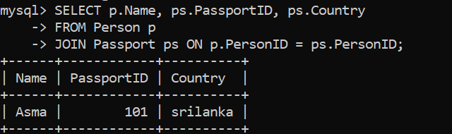
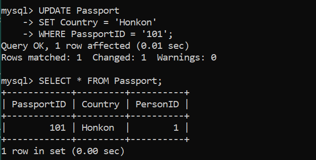
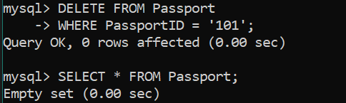

# 🧾 Database Table information Select Queries :

``` sql 
SELECT p.Name, ps.PassportID, ps.Country
FROM Person p
JOIN Passport ps ON p.PersonID = ps.PersonID;

```
` SELECT p.Name, ps.PassportID, ps.Country`  – We choose which columns to display.

`FROM Person p – Shortens the table name Person to p.

` JOIN Passport ps ON p.PersonID = ps.PersonID` – Combines rows from both tables where PersonID matches.



----

# 🧾 Database Table information update Queries :

``` sql 
UPDATE Passport
SET Country = 'India'
WHERE PassportID = '101';
```
- `UPDATE Passport `– Modifies the Passport table.

- `SET Country` = 'India' – Changes the country to 'India'.

- `WHERE PassportID` = 'P123456' – Only update this specific passport.




----

# 🧾 Database Table information delete Queries :

``` sql 
DELETE FROM Passport
WHERE PassportID = '101';
```

- `DELETE FROM Passport` – Deletes data from the Passport table.
- `WHERE PassportID = '101' ` – Only deletes the row with that ID.




