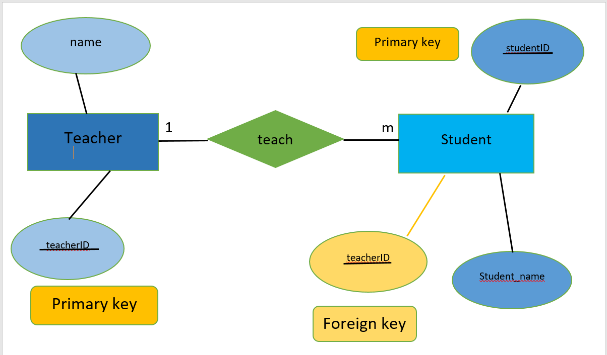
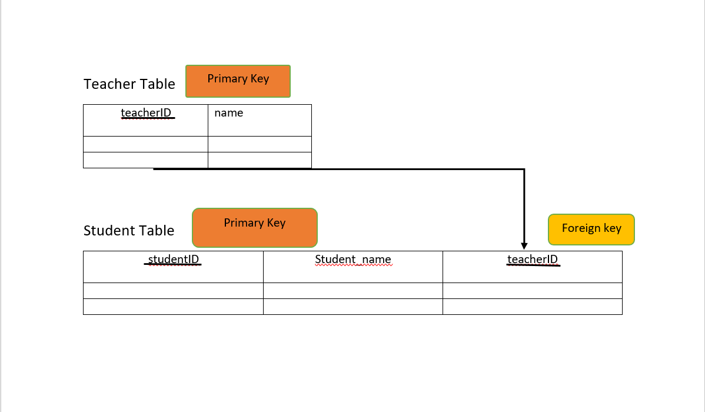

# 📚 one - to - many Relationship Learning Guide. 

## ❓ Question :

### How can you model a system where each teacher can teach many students but each student is assigned to only one teacher?

## 🏷️ Entities :

- Student (Table)
- Teacher (Table)

## 🔑 Keys :

- In the `student` table `studentID` is the primary key.

- In the `teacher` table `teacherID` is the primary key.

- In the `student` table have `teacherID` is a foreign key that links to `teacherID` this mean each student is assigned ti one teacher.

----

## 🖼️ ER Diagram :

----

## 🧱 Tables:

----

