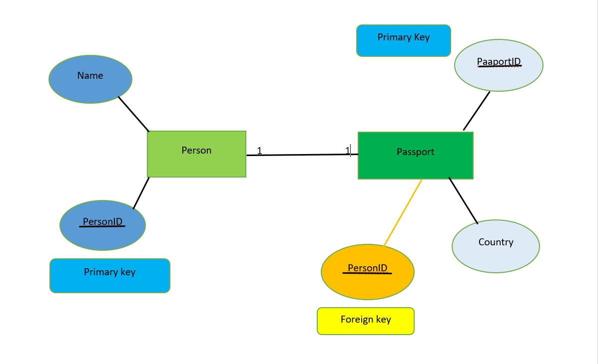
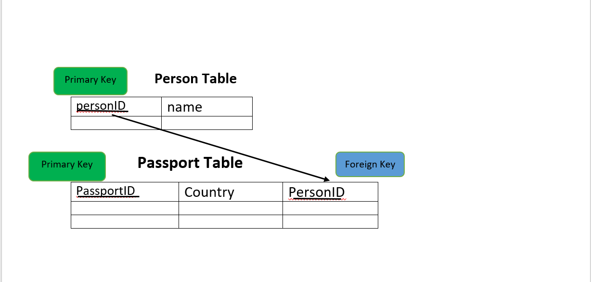

# 📚 one - to - one Relationship Learning Guide. 

## ❓ Question :

### How can you model a system where each person has only one passport, and each passport belongs to only one person?

## 🏷️ Entities :

- Person (Table)
- Passport (Table)

## 🔑 Keys :

- `PassportID` is the ` Primary Key` : it uniquely identifies each passport.

- `PersonID` is a `Foreign Key` : it links each passport to a person in the Person table.

- PersonID  is unique in Passport, so one person has only one passport.
This makes sure each person has only one passport and each passport belongs to one person (1:1).

----

## 🖼️ ER Diagram :

----

## 🧱 Tables:

----

